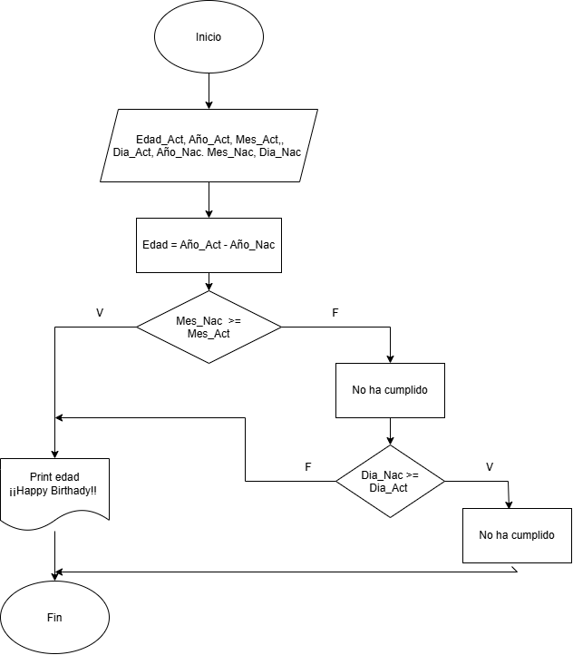

## Toma de decisiones en Diagrama de flujo
La toma de decisiones en un diagrama de flujo es el punto critico donde el proceso evalúa una condición o pregunta.  
### Elementos
1. *El símbolo*: Un rombo, contiene la pregunta.
2. *Lineas de salida* : Desde el rombo salen dos o más flechas. Cada una marcada con una de las siguientes opciones, Sí / No o Verdadero / Falso.
3. *Bifurcación del proceso* : Divide el camino del diagrama. Una respuesta lleva a la otra y así sucesivamente.
### Ejemplo

