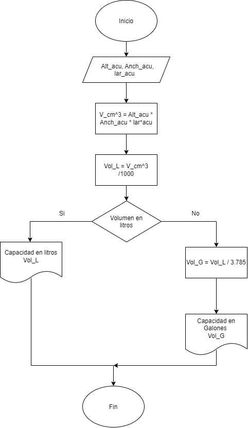

## Problematica del Acuario 
Un acuario necesita determinar cuántos litros o galones (eso lo decide el usuario) de agua caben en un acuario, pero solo dispone de una cinta métrica (en centímetros). Diseña un algoritmo para solucionar el problema.  
### Construye el algoritmo con los siguientes datos:  
    1. DATOS DE LA CINTA METRICA  
    2. CONVERTIR A LITROS  
### Calcular 🧮:
    1. PASAR LOS CM A LITROS/GALONES
### Mostrar en pantalla 💻:
    1. LITROS PARA LLENAR LA PISCINA

