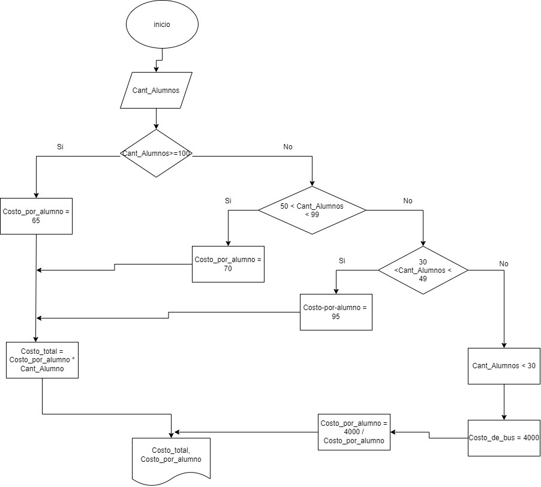

## Problematica de la escuela
El director de una escuela está organizando un viaje de estudios, y requiere determinar cuánto debe cobrar a cada alumno y cuánto debe pagar a la compañía de viajes por el servicio. La forma de cobrar es la siguiente: si son 100 alumnos o más, el costo por cada alumno es de $65.00; de 50 a 99 alumnos, el costo es de $70.00, de 30 a 49, de $95.00, y si son menos de 30, el costo de la renta del autobús es de $4000.00, sin importar el número de alumnos.  
## Construye el algoritmo con los siguientes datos:  
    1. CANTIDAD DE ALUMNOS
    2. COSTO DE CADA PASAJE POR ALUMNO
       - DE 50 A 99: $65000  
       - DE 30 A 49: $70000
    3. MENOS DE 30 ALUMNOS EL COSTO DE LA BUSETA SON $400000
### Calcular 🧮:
    1. COBRO A CADA ALUMNO
    2. VALOR A PAGAR A LA COMPAÑIA DE VIAJES
### Mostrar en pantalla 💻:
    1. COSTO TOTAL DEL VIAJE
    2. COBRO A CADA ALUMNO

