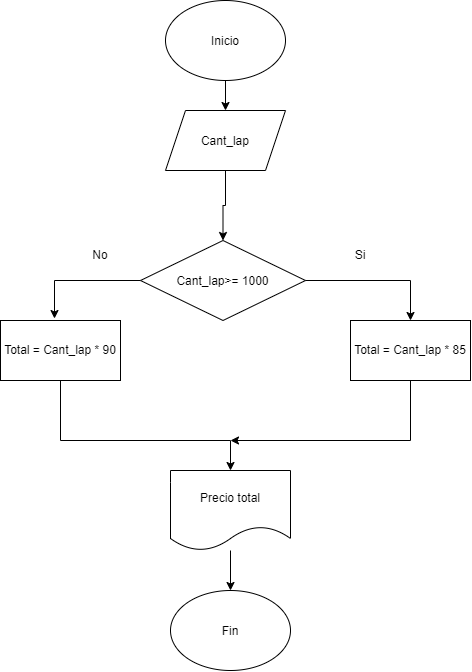

# Diagrama de flujo :pager: :bar_chart:  
Analicemos el siguiente problema y representamos su solucion mediante algoritmo secuencial
## Construye el algoritmo con los siguientes datos:  
    1. 100 o más lapices 
    2. Costo $90
    3. Costo $85
## Calcular 🧮:
    1. PRECIO FINAL    
## Mostrar en pantalla 💻:
    1. PRECIO FINAL
## Pseudocodigo
'''Inicio  
  Leer Cant_lap  
   Si (Cant_lap >= 1000)  
     Precio_unitario = 85  
   Sino   
     Precio_unitario = 90  
  Fin si  
   Precio total = Cant_lap * Precio_unitario  
   Imprimir "Precio total" Total  '''
Fin
  
