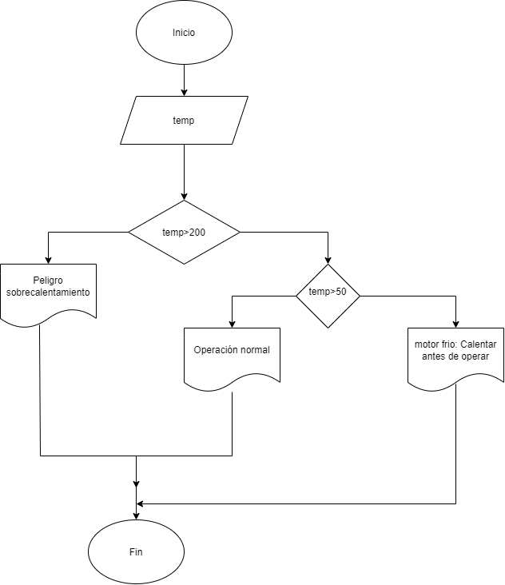

# Diagrama de flujo :pager: :bar_chart:  
Durante una inspección de rutina, se mide la temperatura de un motor de turbina. Si la temperatura es mayor a un valor crítico, se debe indicar "Peligro: sobrecalentamiento". Si está dentro del rango seguro, indicar "Operación normal". Si es demasiado baja, indicar "Motor frío – Calentar antes de operar".  

## Mostrar en pantalla una de las siguientes 💻:
    1. Peligro, sobrecalentamiento
    2. Operación normal
    3. Motor frio, calentar antes de operar

