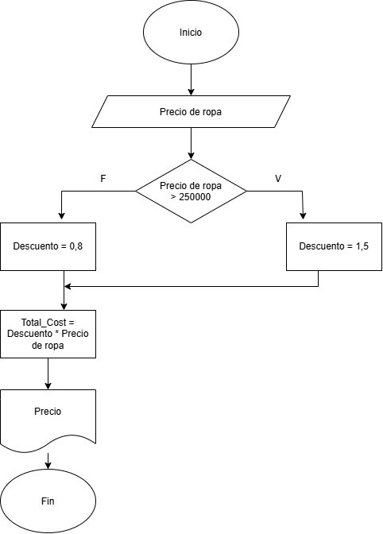

## Diagrama de flujo :pager: :bar_chart:  
Analicemos el siguiente problema y representamos su solucion mediante algoritmo secuencial
### Construye el algoritmo con los siguientes datos:  
    1. Compras superiores a $250000  
    2. Descuento del 8% 
    3. Descuento del 15% 
### Calcular 🧮:
    1. PRECIO FINAL    
    2. DESCUENTO REALIZADO
### Mostrar en pantalla 💻:
    1. PRECIO TOTAL

