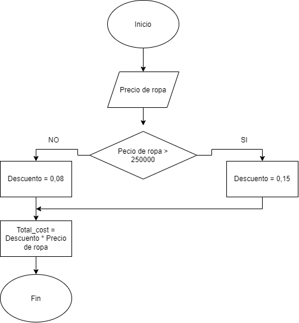

# Diagrama de flujo :pager: :bar_chart:  
Analicemos el siguiente problema y representamos su solucion mediante algoritmo secuencial
Un almacén de ropa tiene una promoción: por compras superiores a $250 000 se les aplicará un descuento de 15%, de caso contrario, sólo se aplicará un 8% de descuento. Realice un algoritmo para determinar el precio final que debe pagar una persona por comprar en dicho almacén y de cuánto es el descuento que obtendrá. Represéntelo mediante el pseudocódigo y el diagrama de flujo.  
## Construye el algoritmo con los siguientes datos:  
    1. Compras superiores a $250000  
    2. Descuento del 8% 
    3. Descuento del 15% 
## Calcular 🧮:
    1. PRECIO FINAL    
    2. DESCUENTO REALIZADO
## Mostrar en pantalla 💻:
    1. PRECIO TOTAL
## Pseudocodigo
```
Inicio   
    Leer "Precio de ropa"  
    Si (Precio de ropa > 250000)  
     Descuento = 0,15  
    Sino   
     Descuento = 0,08  
    Fin Si   
   Precio total = Precio de ropa * Descuento  
   Imprimir "Costo total", Precio total  
Fin
```

