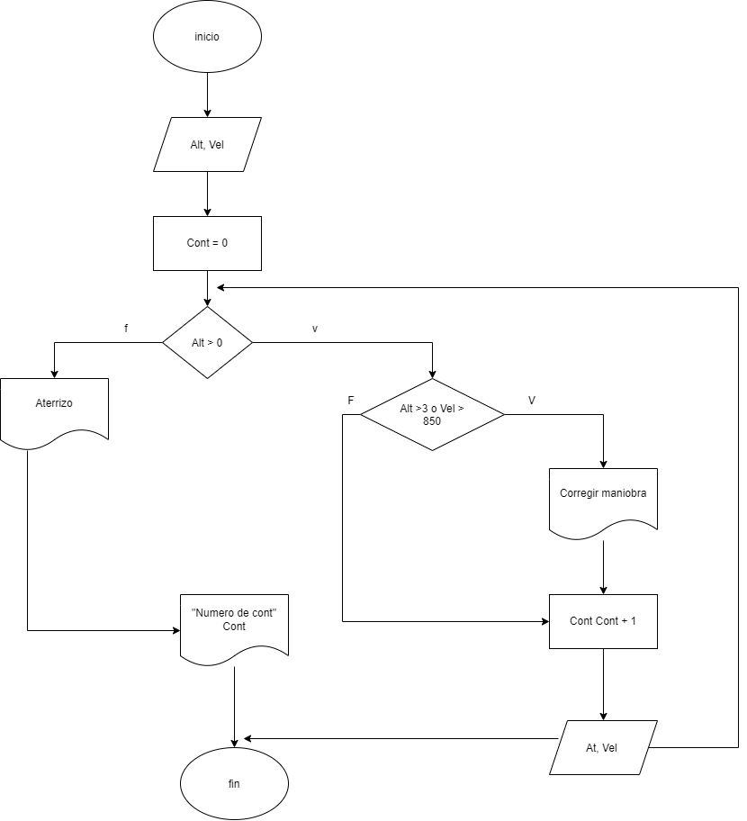

# EL BUCLE WHILE ⏳
En un diagrama de flujo, el bucle while se representa mediante un rombo de decisión que evalúa una condición antes de ejecutar cualquier instrucción, junto con una flecha de retorno que crea el ciclo.
​
## Componentes clave en el diagrama 📊
   ​1. El Rombo (Decisión): Contiene la condición lógica (por ejemplo, ¿contador <= 5?). Tiene dos salidas: Sí (True) y No (False).    
​   2. El Cuerpo del Bucle (Rectángulos de proceso): Son las instrucciones que se ejecutan mientras la condición sea verdadera. Aquí también se actualiza la variable de control (por ejemplo, contador = contador + 1).
​   3. La Flecha de Retorno (El ciclo): Nace al final de las acciones del bucle y apunta de vuelta hacia arriba, justo antes del rombo de decisión.  
​   4. Salida del Bucle: La flecha del camino No apunta hacia la siguiente instrucción fuera del ciclo.
## Flujo paso a paso
​   1. Evaluación inicial: El flujo entra al rombo de decisión.
   2. ​Si es Verdadero (Sí): Sigue la flecha hacia las acciones, las ejecuta y la flecha de retorno lo lleva de nuevo al rombo.
​   3. Repetición: Vuelve a evaluar la condición. Si sigue siendo verdadera, repite el proceso.
​   4. Si es Falso (No): Sigue la flecha de salida y el programa continúa con el resto del diagrama.
​   5. Dato clave: En el bucle while, la condición se evalúa al principio. Si la condición es falsa desde el primer intento, el bloque de instrucciones nunca llegará a ejecutarse.
### Ejemplo 1

### Ejemplo 2 
Durante la aproximación, un sistema recibe datos de altitud y velocidad cada 5 segundos hasta el aterrizaje. Si la velocidad excede el valor máximo seguro o la altitud no desciende adecuadamente, debe indicarse un mensaje de corrección de maniobra. Mostrar un resumen final de todos los avisos emitidos.  

